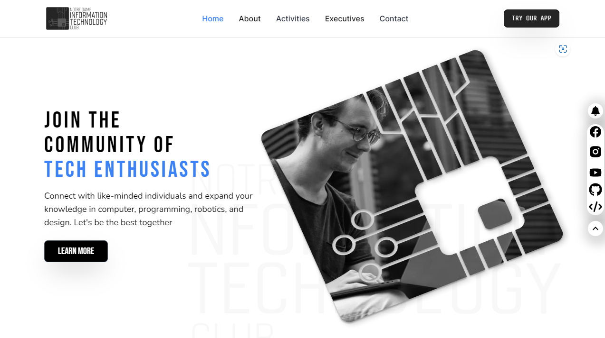

# Official Website - NDITC

#### NDITC - Notre Dame Information Technology Club

### https://nditc.net - Click to see

Welcome to the official repository for the NDITC website. Here you can explore how we developed our official. If you are a member of NDITC and if you want to contribute then have a talk with our executive panel then you will be able to access push your ideas to this repository.

## Tech Stack Used

| Front-End      |     | Back-End |
| -------------- | --- | -------: |
| Typescript 5   |     |   Python |
| Next.js 14     |     |   SQLite |
| React.js 18    |     |
| Tailwind.css 3 |     |

## Any Issues?

Please contact to info.nditc.official@gmail.com or open an issue if you find any bugs and issues. We would be very grateful to you.

## Contributions

### Supervision and Guidelines

- Ahammed Shawki - President (2022-23), Web and App Development
- Naimur Rahman - Secretary (2022-23), Web and App Development
- Nafe Ibne Delowar - Organizer, Batch '24
- Adib Adnan Hoque - Organizer, Batch '24

### Designers

- Adib Adnan Hoque - Organizer, Batch '24

### Full Stack Web Developers

- Wasif Rahman Swapnil - Member, Batch '25
- HRM Rafsan Amin - Member, Batch '25

### Front End Web Developers

- Tahsan Hossain Niloy - Member, Batch '25
- Mansifur Rahman Rafsan - Member, Batch '25
- Redwanur Rahman - Member, Batch '25

### Back End Web Developers

- Naimur Rahman - Secretary (2022-23), Web and App Development
- Muksifur Rahman - Member, Batch '25

## Contact Us

- [Telephone](tel:01885-925097)
- [Website](http://nditc.net/)
- [Facebook](https://www.facebook.com/nditc.official)
- [LinkedIn](https://www.linkedin.com/company/nditc/)
